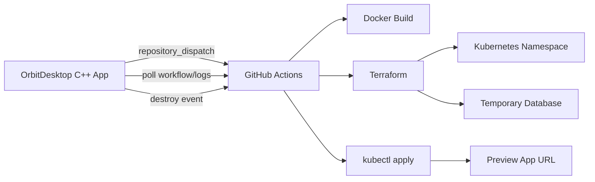

# OrbitDesktop

OrbitDesktop is a C++ Windows prototype for launching short-lived preview environments from a developer workstation. The app models a platform workflow where a developer selects a repository, branch, infrastructure template, and TTL, then dispatches a CI/CD pipeline that builds, provisions, deploys, monitors, and destroys the environment.

The current desktop app uses simulated providers so it can run locally without cloud credentials. The repository includes GitHub Actions, Terraform, Kubernetes, Docker, security, and FinOps examples to show how the simulation maps to a real platform engineering implementation.

## What It Demonstrates

- C++ desktop application architecture
- Developer Experience tooling
- GitHub Actions `repository_dispatch`
- Docker image build and push flow
- Terraform plan/apply/destroy lifecycle
- Kubernetes namespace, deployment, service, ingress, and secret patterns
- Preview environments per branch
- TTL-based cleanup
- Cost visibility and FinOps controls
- Security considerations for tokens and temporary credentials

## User Journey

1. The developer opens OrbitDesktop.
2. The app authenticates with a Git provider token.
3. The developer searches repositories and selects a branch.
4. The developer chooses an infrastructure template and TTL.
5. OrbitDesktop dispatches the environment workflow.
6. GitHub Actions builds, provisions, and deploys the branch.
7. OrbitDesktop shows logs, URL, database credentials, expiration, and estimated cost.
8. The developer clicks Nuke when testing is finished.

## Architecture



## Repository Layout

```text
DevEx/                       Visual Studio C++ project
.github/workflows/           CI/CD workflow examples
infra/terraform/              Terraform preview environment example
infra/k8s/                    Kubernetes manifests
examples/sample-app/          Minimal containerized app
docs/                         Architecture, security, FinOps, roadmap
```

## Build

Open `DevEx.slnx` in Visual Studio and build the `Debug|x64` configuration.

From a Developer PowerShell with MSBuild available:

```powershell
msbuild DevEx.slnx /p:Configuration=Debug /p:Platform=x64
```

## Prototype Credentials

This prototype accepts any token with at least 12 characters.

- Include `admin` in the token text to simulate an admin role.
- Include `maintainer` in the token text to simulate a maintainer role.
- Any other valid token becomes a developer role.

## Next Real Integration

The C++ app is already shaped around provider/orchestrator interfaces. A production implementation would replace the simulated classes with:

- GitHub OAuth or GitHub App authentication
- REST calls to list repositories and branches
- `repository_dispatch` calls to trigger workflows
- workflow run polling or WebSocket/SSE log streaming from a backend
- encrypted storage through Windows Credential Manager

