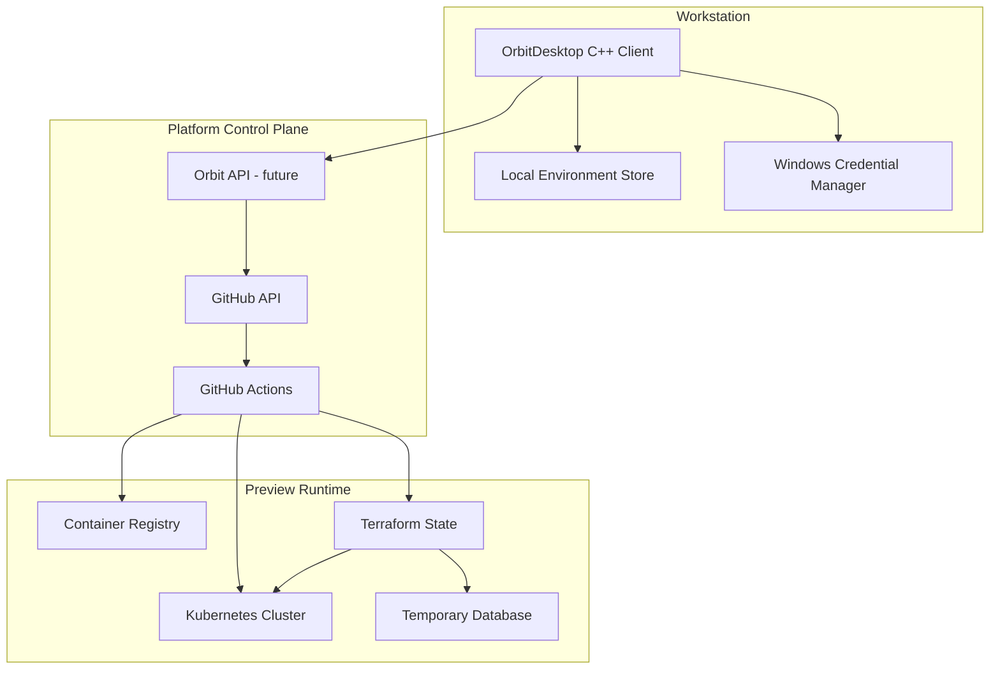

# Architecture

OrbitDesktop is designed as a local developer experience layer over cloud-native delivery primitives.

## Logical Components

## Production Flow

1. OrbitDesktop authenticates the developer through OAuth or a GitHub App flow.
2. The app lists only authorized repositories and branches.
3. A launch request contains repository, branch, template, TTL, and owner metadata.
4. GitHub Actions builds the branch image and tags it with repository, branch, SHA, and environment ID.
5. Terraform creates isolated infrastructure resources using labels for ownership, TTL, and cost allocation.
6. Kubernetes receives manifests scoped to the generated namespace.
7. Health checks publish the final URL and temporary credentials as workflow outputs or backend records.
8. OrbitDesktop shows status, logs, URL, credentials, expiration, and estimated cost.
9. Nuke dispatches a destroy workflow and removes cloud resources.

## Why A Backend Later

The prototype can call GitHub directly, but a real product should include an Orbit API between the desktop app and infrastructure. That API centralizes audit logs, policy, token exchange, cost rules, retries, and environment history.

