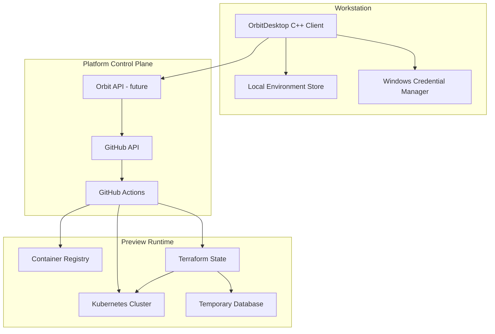

# Architecture

OrbitDesktop is designed as a local developer experience layer over cloud-native delivery primitives.

## Logical Components

```mermaid
flowchart TB
    subgraph Workstation
        UI[OrbitDesktop C++ Client]
        Store[Local Environment Store]
        Vault[Windows Credential Manager]
    end

    subgraph ControlPlane[Platform Control Plane]
        API[Orbit API - future]
        Git[GitHub API]
        Actions[GitHub Actions]
    end

    subgraph Runtime[Preview Runtime]
        Registry[Container Registry]
        TF[Terraform State]
        Cluster[Kubernetes Cluster]
        Database[Temporary Database]
    end

    UI --> Store
    UI --> Vault
    UI --> API
    API --> Git
    Git --> Actions
    Actions --> Registry
    Actions --> TF
    TF --> Cluster
    TF --> Database
    Actions --> Cluster
```

## Workstation Architecture & Runtime Details

- **Local Storage Engine**: The local environment configuration and logs are persisted inside a robust **JSON Lines** flat-file store (`EnvironmentStore`), which natively supports nested values, avoiding structural errors or parser failures typical of CSV/TSV format when parsing dynamic multiline logs.
- **Asynchronous Execution (Non-blocking UI)**: The workstation UI delegates heavy execution tasks (such as curl API polling and local shell processes) to background tasks using `std::async(std::launch::async)`. These tasks are lifetime-managed within the host application via `std::future` tracking to eliminate resource leaks (use-after-free) or detached thread dangling.
- **Mutex Isolation**: Critical resources, particularly the list of active environments, are protected by a dedicated mutex (`environmentsMutex`). Locks are released prior to dispatching background tasks to prevent callback recursion deadlocks.

## Production Flow

1. OrbitDesktop authenticates the developer through OAuth or a GitHub App flow.
2. The app lists only authorized repositories and branches.
3. A launch request contains repository, branch, template, TTL, and owner metadata.
4. GitHub Actions builds the branch image and tags it with repository, branch, SHA, and environment ID.
5. Terraform creates isolated infrastructure resources using labels for ownership, TTL, and cost allocation.
6. Kubernetes receives manifests scoped to the generated namespace.
7. Health checks publish the final URL and temporary credentials as workflow outputs or backend records.
8. OrbitDesktop shows status, logs, URL, credentials, expiration, and estimated cost.
9. Nuke dispatches a destroy workflow and removes cloud resources.

## Why A Backend Later

The prototype can call GitHub directly, but a real product should include an Orbit API between the desktop app and infrastructure. That API centralizes audit logs, policy, token exchange, cost rules, retries, and environment history.

